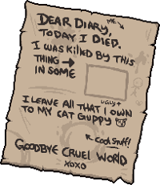

# Alveria

- Alba(흰)+Veritas(진실)=Alviera -> Alveria
- 맵 중간중간 흰색 나비, 비둘기가 있을텐데 이게 히든보스 떡밥
- 네이밍 센스가 좋지 않아서 이 정도 제목이 최선이었다.
- 제목은 나중에 바뀔 수 있음

## 게임 개요

### 장르
스토리 중심 로그라이크 던전 마법 액션  
(세이브 없음, 무작위 던전, 루프 기반 진행)

---

## 줄거리

심연을 연구하는 마법학원 ‘크로니카 마법학원’.  
이곳에는 심연의 힘을 탐색하기 위해 모인 재능 있는 마법사들이 존재한다.  
플레이어는 그중에서도 보기 드문 다속성 재능을 가진 마법사이며,  
소꿉친구인 ‘엘라리아’는 시간 마법 분야에서 가장 뛰어난 천재로 평가받았다.  

추가 과거 스토리  
엘라리아는 1차 심연의 폭주에서 부모을 잃었다.  
이후 시간 마법에 대해 연구하였고 금지된 마법인 자기 자신을 과거로 보내는 마법을 사용한다.  
부모를 살리려고 했지만 그렇게 하면 타임 패러독스가 발생하고 자신까지 사라진다는 것을 그 과정에서 알게 되었다.  
부모는 다음에 지킬 사람이 있으면 더 강해져서 지키면 된다고 한다. 이것이 엘라리아를 최고의 시간 마법사로 만들었다.  
하지만 결국 누군가의 죽음 이후 그 죽음을 되돌리는 것은 불가능했다. 죽기 전에 시간을 되돌려야 했던 것이다.  
부모를 잃은 이후 매일 혼자 연구하던 엘라리아의 옆에는 항상 플레이어가 있었고 정신적으로 지지해준다.  
연구 과정에서 엘라리아의 심연에 대한 복수심이 커졌고, 다시는 소중한 사람을 잃지 않을 것이라는 생각을 하게 된다.  

그러던 어느 날, 엘라리아는 미래를 관측해  
심연이 폭주하고 플레이어가 반드시 죽게 된다는 결말을 발견하게 된다.  
그리고 이 관측으로 인해 플레이어의 죽음은 확정이 되어 버렸다. 엘라리아는 이것에 최책감을 가진다.  
어떤 선택을 해도 바뀌지 않는 미래. 
그걸 막기 위해 노력했지만 결국 마지막 전투에서 플레이어가 치명상을 입는다.  
(이 마지막 전투부터 시작한다. 확정 패배 이벤트이다.)  
엘라리아는 결국 이 운명을 바꿀 수 없음에 절망했고 플레이어가 완전히 죽기 전 루프 마법을 발동하게 된다.  
엘라리아 자신이 플레이어가 죽는 고통을 대신 느껴야 했지만 이전 가족의 트라우마와 죄책감 때문에 어떻게든 살려야 한다는 생각으로 시간을 되돌리는 루프 마법을 발동시킨다.  

플레이어가 죽을 때마다, 그 죽음의 고통은 엘라리아가 대신 겪는다.  
이 사실을 모른 채 플레이어는 루프 속에서 강해지며  
세계의 비밀과 엘라리아의 진심에 다가가게 된다.

겉으로 보기엔 단순한 반복일지 몰라도,  
그 이면에는 누구도 눈치채지 못한 한 사람의 희생이 숨어 있다.  

---

## 진행 시스템

### 챕터 시스템
- **총 4챕터**
- 각 챕터는 무작위 던전으로 구성
- 챕터 클리어 시 스토리 이벤트 1회 발생 (크로니카 마법학원 내부)

### 루프
- 사망 시 루프, 던전/스토리 진행 초기화
- 일부 서브 요소(도서관 정보와 1회성으로 발생하는 npc 퀘스트)는 루프 간 유지 가능

### 던전
- 챕터별 무작위 구조, 몬스터, 아이템
- 보스 전투 포함
- 치트 없음 상태에서 진입

---

## 크로니카 마법학원

### 기능
- 상점
- 딜 테스트기
- 업적 등 감상
- 도서관 (세계관, 기록 열람)
- 챕터 이벤트 발생
- 심연 입구 위치

---

## 치트 시스템

### 획득 조건
- 히든보스(엘라리아의 고통 실체) 처치 시 플레이어 계승

### 기능 예시
- 부활(초기화가 아니라 그 자리에서 부활)
- 방 아이템 리셋
- 방 구조 초기화
- 희귀 아이템 확률 상승

### 부작용
- 치트 사용 시 치트 오염 적 등장 (강력한 특수 몬스터)
- 엔딩 루트에는 영향 없음 (엘라리아 해방 이후 치트 없이 히든 보스 클리어 시 약간의 보상 존재)

---

## 엔딩 구조

- **노멀 엔딩**: 심연 최종보스 처치
- **히든 엔딩**: 히든보스(엘라리아의 고통 실체) 처치 → 엘라리아 해방
- **치트 시스템 해금**: 히든보스 클리어 시 자동 획득
- **치트 미사용 상태로 히든보스 클리어 시**: 도전 과제 달성, 시작 화면에 흰 나비 등장 등 연출 변화

---

## 챕터별 스토리 이벤트 구조

- **발생 조건**: 각 챕터 클리어 후 크로니카 마법학원 진입 시
- **위치**: 심연의 입구 앞에서 플레이어가 다음 챕터 진입하기 직전, 또는 상점에서 골드가 없을 때 찾아와서 말을 건다.

### 📖 챕터 1 이벤트
- **조건**: 1회 이상 죽으면 엔딩에 나오는 메모를 보고 나타나게 된다. (처음에 확정 패배 이벤트가 있어서 사실 없는 조건이다.)
- **NPC/연출**: 시즈(학원 내에 돌아다니는 조용한 소녀로 보이지만 오래 전 크로니카 마법학원에서 만들어진 도서관을 관리하는 기록 보관용 마법 생명체(베아트리스 느낌))
- 플레이어가 죽을 때 나오는 메모가 발견한 적이 없는데 갑자기 도서관에 흘러들어왔다. 심연의 폭발을 이길 정도로 강해지라는 메모에서 플레이어의 이름을 발견하고 플레이어를 따라다니다가 이때 나타난다. 
- **이벤트 내용**: 도서관이 해금된다. 시즈는 그 메모가 존재하지 않는 미래에서 온 것이라고 한다. 아는 것이 있냐고 간단히 물어보고 자신은 도서관에 있으니 뭔가 알게 되면 말을 걸어달라고 한 뒤 짧게 이벤트가 끝난다. 
- 여기에서 메모는 이런 걸 의미한다.  

  

첫 패배 이벤트에서 여기에 이런 대사를 넣을 예정  
"살아야 해"  
"강해져"  
"바꿔야 해"  
"바꾸지 못했어"  
"어째서 너마저"  
"안돼"  
"어떻게 해서든"  
"살아남아"  
"떠나지 말아줘"  

**"이게, 마지막 방법이야."**

### 📖 챕터 2 이벤트
- **NPC/연출**: 자바르트(시간 마법 교수)
- 자바르트 교수는 엘라리아가 나타나기 전까지 가장 뛰어난 시간 마법사였지만 나이를 먹으면서 이전과 같은 전투 능력은 낼 수 없고 연구 활동만 하고 있다. 연구 활동 도중 미약한 루프의 흔적을 발견하여 그 흔적을 따라 플레이어에게 접근한다.
- **이벤트 내용**: 시간 마법을 실험해보고 골드를 주겠다고 한다. 약간의 전투 이후 루프에 대해서 언급한다. 엘라리아, 플레이어 외에 유일하게 조금이나마 루프를 감지한 사람이다.

### 📖 챕터 3 이벤트
- **NPC/연출**: 에일라(눈이 안 보이게 되어 은퇴한 점술사)
- 강한 운명과 사랑이 존재한다는 것을 플레이어에게서 감지하여 커플인줄 알고 말을 걸었다. 눈이 보이지 않아서 플레이어 1명인데 엘라리아의 존재를 어느 정도 눈치채고 말을 건 것이다. 
- **이벤트 내용**: 다가와서 “이상하군요. 두 분인 줄 알았어요. 아니... 맞닿은 운명이라 그랬을까요.” 이런 말을 하고 간단한 운명을 봐준다며 의식에 참여시킨다. 
플레이어는 혼자지만 여자 쪽에 수많은 죽음의 운명이 있는 것을 보고 놀라고 자신이 실력이 죽었다고 생각한다. 제대로 된 결과를 보여주지 못했다고 생각하여 시간 뺏어서 미안하다고 하면서 돈을 준다. 

### 📖 챕터 4 이벤트
- **조건**: 챕터 123 이벤트를 모두 보고 노멀 엔딩을 1회 클리어한 이후 등장한다. 
- **NPC/연출**: 누군가가 후드를 눌러쓰고 등장한다. 자바르트 교수이지만 플레이어는 알아보지 못한다. 
심연의 폭발이 일어날 때 플레이어는 견딜 수 있다는 것을 보고 주변 사람들에게 피해가 없게 자신의 모든 마력을 사용해서 플레이어 제외 다른 학생들을 폭발 영향 범위로부터 벗어나게 한다. 
- **이벤트 내용**: 갑자기 나타나서 심연이 닫히려고 할 때 뛰어들어보라는 이야기를 한다. 미래를 관측하여 조언을 해준 것이다.

---

## 히든보스 시스템

### 입장 조건
- 챕터 4 이벤트에서 메시지를 본 이후
- 심연 클리어 직후 특수한 입장 선택지 발생

### 전투 연출
- 붉은 나비, 비둘기 패턴
- 감정적 몰입 유도, 실체화된 고통과의 전투

### 클리어 결과
- 엘라리아 해방 (히든 엔딩 도달)
- 치트 시스템 해금
- 치트 사용 없이 클리어 시 추가 연출 (예: 시작 화면에 흰 나비 등장)

[//]: # (사람 이름은 그냥 gpt가 만들어준거 쓰고 있는데 언제 바뀔지는 몰?루)

심연은 세계의 설계자라고 불리는 존재들이 만들다가 버린 세계가 뒤섞인 공간이다.  
세계의 설계자는 이 게임을 기획하고 있는 나 자신이다.  

## 히든보스 첫 격파 과정에서 스토리 컷신

히든보스와 첫 전투는 죽어도 계속 부활이 된다. 그리고 죽으면 보스 hp가 5% 깎인다. 엘라리아가 고통을 받기 때문이다.  
살아있는 강력한 엘라리아의 의지가 부활을 시킨다.  
언더테일 불살루트 플라위 전투 생각하면 된다.  
hp 일정 수준 이상 깎으면 시간이 멈추고 공간이 깨지는 연출과 함께 컷신 스토리로 전환  

### 진입

내 선택이... 너를 힘들게 할 뿐이었던 것일까?

아직도 그 날을 기억하고 있다.  
곳곳에 심연의 균열이 나타나고, 사람들은 그곳에서 나온 세계의 설계자들에 의해 죽임을 당했다.  
그 존재는 누구고, 목적이 무엇이었을까?  
이후 나는 크로니카 마법학원에 들어갔다.  
그곳에서는 다시 올 심연의 폭발에 대항하기 위한 마법사들을 교육시켰다.  
나에게는 재능이 있었다.  
그리고 나는 부모님을 보기 위해 이 재능을 사용했다.  
결국 나는 과거로 가는 마법을 완성시켰다.  
하지만 나는 부모님을 살릴 수 없다는 것을 누구보다도 잘 알고 있었다.  
내가 부모님을 살리는 순간, 내가 만든 마법은 존재하지 않게 된다.  
나는 이 사실을 알고, 한동안 마법 연구를 할 수 없을 정도로 의지를 잃었다.  

### hp 1/4

내가 한동안 절망감에 빠져 있을 때, 플레이어가 말을 걸어왔다.  
부모를 잃은 나와 같은 처지였지만, 나와 달리 절망에 빠지지 않았다.  

'이 나비는 뭐지...'  
"안녕"  
"놀랐잖아."  
"옆에 앉아도 될까?"  
"..."  
"되는 걸로 알게."  
"너는 마법을 왜 배워?"  
"10년 전과 같은 일을 다시 겪을 수는 없잖아."  
"다음에는 내가 지켜야지."  
"나는 이제 지킬 사람이 남지도 않았어."

지켜야 할 것이 사라졌다는 자각.  
마법을 쓸 이유도, 살아갈 이유도 함께 사라진 공허감.  
하지만 플레이어는, 가만히 내 옆에 앉았다.  
무어라 위로하지도, 억지로 웃기지도 않았다.

"그래도… 지키고 싶은 가치는 남아있어."

### hp 2/4

나는 고개를 돌렸지만, 그 아이는 허공을 바라보며 마법진을 그리기 시작했다.  
낯선 구조였다. 정식 교육에서 배운 마법진과는 다른 방식.  
그건 완벽하지 않았지만… 이상하게 따뜻했다.  
순간, 빛이 피어오르기 시작했다.  
그의 마법진에서 나온 수많은 빛의 조각들이  
천천히 나비의 형상으로 흩어졌다.  
작고, 여리고, 온기가 있는 나비들이 저녁 노을을 타고 날아올랐다.  

"이건 보호 마법도, 공격 마법도 아니야."  
"그냥… 내가 보고 싶었던 장면이야."  

나는 숨을 삼켰다.  
그 나비들은 하나하나, 그가 마음속에 그리던 기억과 닮아 있었다.  
희망, 상실, 그럼에도 불구하고 살아가는 의지.  
하지만 겨우 이걸 보고 싶어서 연구한 것인가?

"언젠가 이 나비들이, 누구에게든 닿으면 좋겠어."  
"살 이유가 없더라도, 그냥 포기하기에는 아름다운 것들이 많아."  

그 말은 칼날처럼 날카롭지도 않았고,  
불처럼 뜨겁지도 않았다.  
하지만 나는 견딜 수 없었다.  
눈물이, 멈추지 않았다.  
그 순간, 나는 결정했다.  
이 아이를 위해 다시 마법을 연구하겠다고.  
다시는 잃지 않도록,  
이 나비들이 사라지지 않도록.  

### hp 3/4

이후 나는 자바르트 교수님과 함께 미래를 보는 마법을 발명했다.  
교수님은 마력이 부족하여 실패했지만 나는 그것을 볼 수 있었다.  
그리고, 2차 심연의 폭발에서 플레이어가 죽었다.  
충격을 받은 나는 분기를 조작하고 가능성이 있는 관측 가능한 미래를 수없이 많이 관측하였다.  
자바르트 교수님은 급하게 나를 멈추었다.  

"지금 몇 개의 미래를 관찰한 거지"  
"안돼..."  
"대답해! 얼마나 많은 미래를 관찰한 거야!"  
"관측 가능한 미래의 99%..."  
"먼저 주의사항을 말해줬어야 했는데..."  
"너가 관측한 시점에서, 미래는 바뀌지 않게 되었다."  
"1%의 가능성이 있다고는 하지만 99%의 미래를 본 이상 1%도 다르지 않을거야."  
나는 충격에 빠졌다. 내가, 플레이어를 죽음으로 인도한 것일까? 아니면 원래 죽을 운명이었던 것일까?  

### 격파

그 날이 다가왔고, 나는 관측하지 못했던 미래대로 움직이려고 했다.  
하지만, 플레이어는, 그 미래에서도 도서관 입구에서 시즈를 지키면서 죽어가고 있었다.  
나는 천천히 다가갔다. 이제 정말 마지막 방법밖에 남지 않았다.  
나를 매개로, 플레이어를 대상으로, 죽음을 트리거로 세계를 반복하는 것이었다.  
물론 부작용은 잘 알고 있었다.  
루프가 끝나기 전까지 나는 잊혀지고, 죽음 직전의 공포와 고통은 모두 나에게 전달된다.  
하지만 상관없었다. 나는 지켜야만 한다.  

"살아야 해"  
"강해져"  
"바꿔야 해"  
"바꾸지 못했어"  
"어째서 너마저"  
"안돼"  
"어떻게 해서든"  
"살아남아"  
"떠나지 말아줘"  

**"이게, 마지막 방법이야."**

"Alveria : 하얀 나비의 진실"

엔딩 크레딧

처음 엔딩을 보면 에일라가 나타나서 플레이어가 엘라리아의 능력으로 치트를 쓸 수도 있지만, 그렇게 되면 적이 강해질 것이라고 한다.  
그리고 그녀의 힘 없이 다시 그녀를 쓰러트리는 운명에 다가가면, 진정으로 엘라리아를 해방시킬 수 있다고 말한다.  

 
 

원래 세계는 질량을 가진 입자가 빛보다 빨라질 수 있는 세계였다. 
초대 용사는 전쟁으로 고아가 된 시즈를 딸처럼 키웠고 시즈는 만화, 라노벨 등을 좋아하고 동심을 가진 아이로 성장하였다. 
하지만 가문이 몰락할 위기에 놓이고 초대 용사는 시즈까지 빼앗길 위기에 놓인다. 
이후 힘을 단련하여 빛의 속도를 넘어서는 참격을 날리게 되었고 그것으로 시간의 힘이 변화하면서 세계의 근원이 되는 심연에 접근하게 되었다. 

초대 용사는 심연에서 계속 나아갔고 심연의 최하층에 도달하였다. 
시즈를 살리기 위해서 이 세계의 법칙을 다시 만들 필요가 있다고 생각하였고 마법력과 시간력이 존재하는 세계로 이 세상을 구성하였다. 
시즈는 그곳에서 동심을 간직한 채로 도서관에서 원하는 것을 마음껏 읽으며 생활할 수 있게 되었다. 
이것으로 세계의 규칙이 다시 쓰였으며 크로니카 마법학원이 존재하는 세계가 구성되었다. 
하지만 시간력을 직접 다룰 수 있게 된다면 점점 임계치를 넘어가고 엘프 종족과 그 혼혈만 사용할 수 있게 설정하였으나 
그들이 대량의 시간 마법을 사용하여 심연과 연결되는 틈이 세계 곳곳에 생겼다. 이것을 심연의 폭주라고 불렀다. 

이후에는 그 루프 스토리이다. 

엘라리아를 잃고 플레이어는 계속 나아가고 심연의 밑바닥에 도달하게 된다. 
그리고 약하게 남아있는 초대 용사의 영혼을 만난 뒤 많은 희생자가 존재하고 세계가 불안정하다는 말을 전한다. 
초대 용사와 플레이어는 그 둘의 소멸을 대가로 빛의 속도는 일정하며, 질량을 가진 입자는 빛의 속도를 넘을 수 없다는 가정을 추가한다. 
이것으로 세계는 우리가 살고 있는 현대의 세계로 재구성되고 루프에서 해방되어 재구성의 영향을 받지 않는 엘라리아는 이 세계에서 유일하게 플레이어의 기억을 가지게 된다. 
엘라리아는 대학생, 자바르트는 물리 교수, 시즈는 봇치가 되어 현대 세계에서 잘 살아간다.

[//]: # (김정헌 피드백 : 엘라리아 불쌍하니 살릴 방법을 찾아라. 심연의 컨셉을 좀 잡으면 좋겠다. 하얀 진실 제목에 맞게 좀 많이 넣어라)

